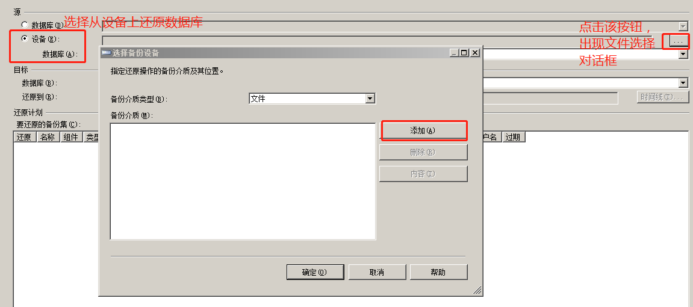
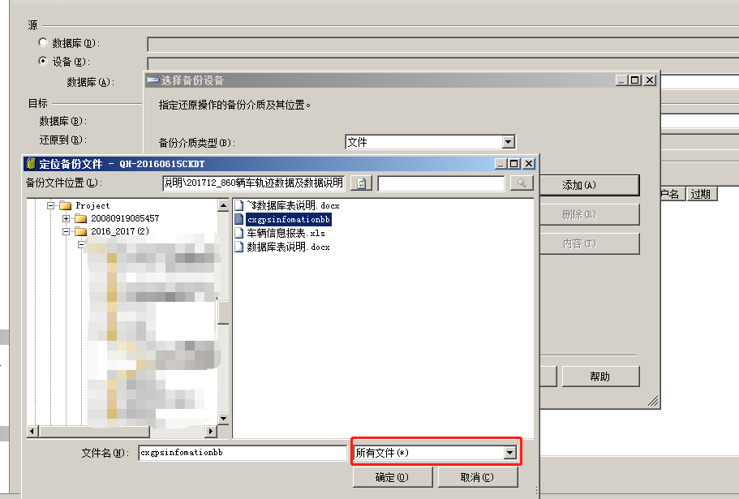
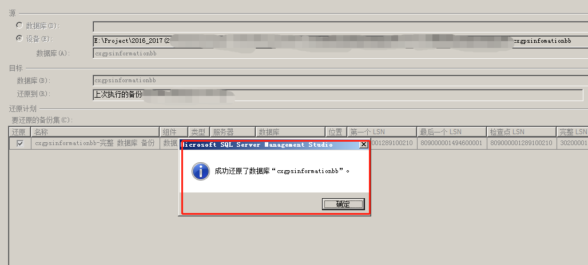

##sql数据库数据文件导入导出
**1、还原数据库** 
一般客户给我们提供的数据是数据库形式。还原数据库：

打开SQL数据库，右键单击数据库出现上图菜单，点击还原数据库，出现下图：

选择从设备上还原数据库：

添加数据库文件，如下图所示：

点击确定即可还原数据库。数分钟过后还原成功。

点击确定。

**2、导出导入excel数据文件**

- [SQL导出excel数据文件](https://jingyan.baidu.com/article/3065b3b68f2ab7becef8a449.html)

- [excel数据表导入SQL](https://jingyan.baidu.com/article/358570f66145a6ce4724fcba.html) 
注：数据文件的字段名不能为空或“NULL”，必须唯一。

##sql数据库中表的基本操作

**1、基于原始表构造新表，以免玩坏数据 **

选择原始表中的若干列，建立新表 
**select** 字段名1,字段名2,字段名3 
**into** 新表名 
**from** 旧表名 
例如： 
select SimNum, GpsTime, ReceTime, AlarmFlag,StateFlag 
into testdbtrack.dbo.biz_Test(新表名) 
from topdbtrack.dbo.bizTrack20160919(旧表名) 

**2、对已有的数据文件进行简单处理操作**

—— 删除速度为0的数据。

首先挂起操作表所在的数据库（use ~ go）

挂起TestDBTrack数据库： 
 **use** TestDBTrack  
 **go**

 删除速度为0的数据 
 **delete** from bizTest 
**where** speed = 0

—— 假设1小时为一段路程，据此划分路程：

—— 创建新表1：

 **create** table tb1                       ——创建空表tb1。表中包含字段定义。 
 (SIM varchar(20) not null,  
路程 int not null, 
时速标准差 numeric, 
时速最大值 **numeric(5,1)** not null,   —— 5位有效数字，1位小数，并且不可缺失  
平均时速 numeric(5,1) not null, 
行驶里程 numeric(18,2), 
行驶时长 int not null, 
驾驶异常 int **default** 0 not null, —— 定义驾驶异常，默认值为0 
)

—— 定义字段值 
**insert** into tb1 (SIM, 路程, 时速标准差, 时速最大值, 平均时速, 行驶里程, 行驶时长) 
select SimNum as SIM, datename(hour,GpsTime) as 路程, stdev(speed) as 时速标准差,  
max(speed) as 时速最大值, avg(speed) as 平均时速, (max(mileage)-min(mileage)) as 行驶里程, 
 DATEDIFF(minute, min(gpstime),max(gpstime)) as 行驶时长 
from bizTest 
**group by** SimNum, datename(hour,GpsTime)   ——分组字段 
**having** avg(AlarmFlag) >0 ——集合函数的查询条件 

**update** tb1 ——修改表中数值 
**set** 驾驶异常 = 1 

**alter table** tb1 ——修改表tb1，增加一个“时长”字段 
**add** 时长             

**alter table** tb1 ——修改表tb1，删除“时长”字段 
**drop** 时长  

注意：alter 是DDL语句，是修改数据库中对象（表，数据库，视图。。）的语句。update是DML语句，是修改表中数据的语句。
要改变表中列的数据类型，请使用下面的语法：
ALTER TABLE tablename
MODIFY COLUMN columnname datatype

—— 创建表2 
select SIM, count(*) as 路程数量, max(时速最大值) as 速度最大值, avg(平均时速) as 速度平均值, avg(行驶里程) as 平均里程
into tb2
from tb1
group by SIM 

—— 删掉中间表 
 **drop** table bizTest

本文主要记录数据文件的导入导出，并通过一个小案例，讲解sql中常见的几个函数功能和使用方法。包括数据库的挂起，表格的创建、修改、删除，数据分组计算、集合函数查询条件函数等。