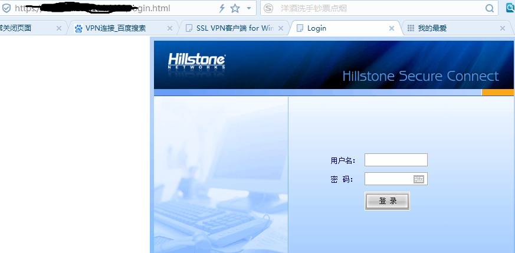

<h4>本文档是关于远程访问服务器中VPN客户端的下载和安装,以及shiny的前端展示。 

### 一、下载VPN客户端
&emsp;&emsp;点击以下链接进入VPN客户端下载网址：
[**VPN客户端下载网址**](http://docs.hillstonenet.com/cn/Content/7_VPN/SSL_VPN.html) 
&emsp;&emsp;登入网址后，选择合适自己电脑操作系统的客户端： 
&emsp;&emsp;[SSL VPN客户端 for Windows](http://docs.hillstonenet.com/cn/Content/7_VPN/SSL_VPN_Client.htm) 
&emsp;&emsp;[SSL VPN客户端 for Android](http://docs.hillstonenet.com/cn/Content/7_VPN/SSL_VPN_Client_A.htm) 
&emsp;&emsp;[SSL VPN客户端 for iOS](http://docs.hillstonenet.com/cn/Content/7_VPN/SSL_VPN_Client_I.htm) 
&emsp;&emsp;[SSL VPN客户端 for Mac OS](http://docs.hillstonenet.com/cn/Content/7_VPN/SSL_VPN_Client_M.htm) 
&emsp;&emsp;[SSL VPN客户端 for Linux](http://docs.hillstonenet.com/cn/Content/7_VPN/SSL_VPN_Client_L.htm) 

不同操作系统的客户端下载安装方式类似，其网页上都有详细的下载安装说明。本文以windows操作系统为例，故点击“SSL VPN客户端 for Windows”链接，进入下载与安装客户端界面。因为该设备端配置是使用“用户名/密码”认证方式的，所以按照以下步骤下载和安装客户端程序Hillstone Secure Connect： 

在浏览器的地址栏输入以下URL访问设备端：https://IP-Address:Port-Number。其中“IP-Address”和“Port-Number”分别为设备端SSL VPN实例中指定的接口的IP地址和HTTPS端口号。该设备端的“IP-Address”和“Port-Number”分别“219.144.130.194”和“4433”。输入后出现下图：
   

输入账号：**********
   密码：**********
 登录后，进入下载界面。点击“下载”，即可下载安装“scvpn.exe”。成功安装后，双击桌面的Hillstone Secure Connect快捷方式，出现以下界面：

&emsp;&emsp;&emsp;&emsp;

在此对话框中填写所需内容，注意这里的信息填的是该设备端的信息。例如服务器和端口分别是“219.144.130.194”和“4433”，用户名是sigma。填完回车，即连接成功。

### 二、shiny的前端展示
VPN连接成功后，应用浏览器展示数据分析的部分结果。根据车辆的SimNum选择不同的车辆进行分析，输出展示该车辆的行驶路线和对该车辆的车险评估结果。其展示结果的链接如下： 
&emsp;&emsp;&emsp;&emsp;[数据分析的前端展示](http://10.53.0.3:3838/)

