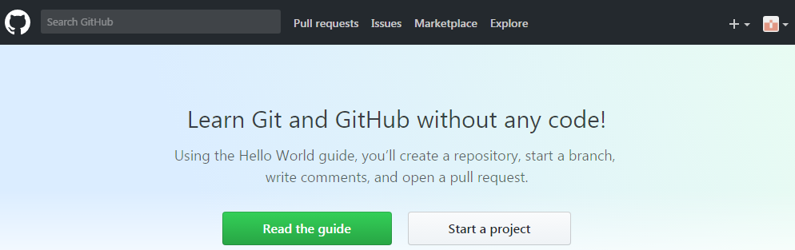

##github的基本操作##
- **1. github的账号申请**

     先登录github的官网：
     [https://github.com/](https://github.com/) 
      进入官网后，在下图的红框中进行账号注册。最好用学校的邮箱进行注册，这样比较容易申请私有账号。 

接下来根据网页上的提示进行申请操作，到了该界面。点击“start a project”。

点击后，网页上会出现邮件确认界面。进入申请时用的邮箱，会有Github发的邮箱确认邮件。点击邮件中的“Verify email address”即可。

邮箱确认后再点击“start a project”进入创建新仓库界面。

- **2. 下载GitHub Desktop**

    官网下载地址: 
[https://desktop.github.com](https://desktop.github.com)

进入下载网页，选择合适自己电脑系统的安装包进行下载安装。

- **3. github 基本功能**

1、Fork主持人的文件夹(同步代码) 

**Clone or download**：将主持人的该文件夹clone到本地github上。

复制图中的网址。

打开本地的github desktop，在file菜单栏下有clone~功能，点击，出现下图clone界面，将网址复制在URL上。

2、自己的账号下修改的merge到主持人的文件夹 

在自己账号下该文件夹中修改编辑后，commit changes。commit后出现下图界面。

点击图中的pull requests，进入New pull request。点击New pull request后，出现以下界面。

点击Create pull request。

