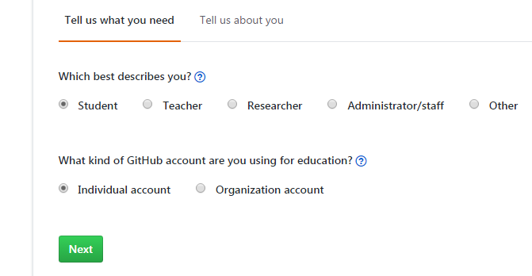

##github上申请免费私有仓库
-  首先要有可用的高校学校邮箱地址和github账号。
如果本身就是高校学校邮箱注册的github账户的话，就直接进入下面链接：
[github私有仓库](https://education.github.com/discount_requests/new)
 进入该界面，登录自己的账户后，出现该界面

选择红框中的链接，进入

选择要申请的账户之后，点击next。填写信息就可以了。提交后会说明在审核中，之多等5天。

- 要是申请账户时不是用高校的邮箱，那么可以添加你的高校邮箱：

在github的设置中添加你的高校邮箱
